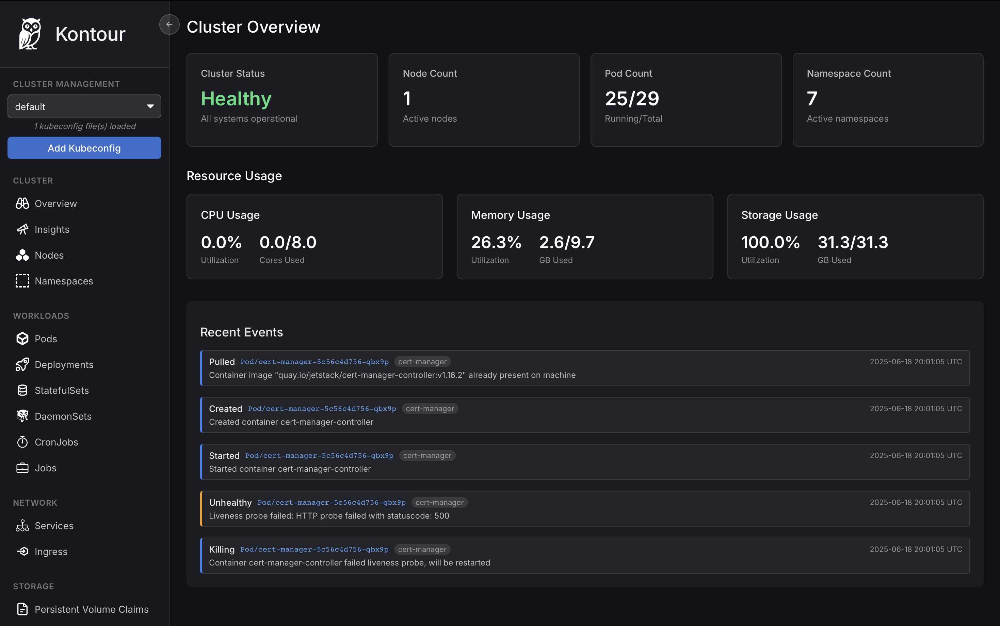

# Kontour - Modern Kubernetes Desktop Manager

A powerful, desktop-based Kubernetes management tool built with Rust and Dioxus. Kontour provides a modern, intuitive interface for managing your Kubernetes clusters with native performance and reliability.



## ✨ Features

### 🚀 **Performance & Architecture**
- Built with Rust for maximum performance and memory safety
- Desktop application using Dioxus framework
- Fast, responsive UI with minimal resource usage

### 🎯 **Comprehensive Resource Management**
- **Workloads**: Pods, Deployments, StatefulSets, DaemonSets, Jobs, CronJobs
- **Networking**: Services, Ingresses
- **Storage**: Persistent Volume Claims (PVCs), ConfigMaps, Secrets
- **Cluster**: Nodes, Namespaces
- **Create Resources**: Built-in forms for creating new Kubernetes resources

### 📊 **Cluster Overview & Monitoring**
- **Dashboard**: Real-time cluster status and health monitoring
- **Resource Usage**: CPU, Memory, and Storage utilization tracking
- **Pod Counts**: Running vs total pods across the cluster
- **Node Status**: Active nodes and their health conditions
- **Recent Events**: Live feed of cluster events and activities

### 🔍 **Advanced Insights**
- **Problem Pod Detection**: Automatic identification of CrashLoopBackOff, frequently restarting, and evicted pods
- **Resource Analysis**: Find pods without resource limits and resource hotspots
- **Unused Resources**: Identify unused ConfigMaps and PVCs
- **Cluster Statistics**: Comprehensive cluster health metrics

### 🔧 **Multi-Cluster Support**
- **Kubeconfig Management**: Upload and manage multiple kubeconfig files
- **Context Switching**: Easy switching between different Kubernetes clusters

### 🛠 **Resource Creation**
Built-in creation forms for:
- Namespaces with custom labels
- Pods with container specifications, environment variables, and resource limits
- Deployments with replica management, selectors, and rolling update strategies
- StatefulSets, DaemonSets, and CronJobs with full configuration options

## 🚀 Getting Started

### Prerequisites

- Rust toolchain (latest stable version)
- A valid kubeconfig file with cluster access
- Dioxus CLI (`dx`) for development

### Installation

1. **Clone the repository**
```bash
git clone https://github.com/your-org/kontour.git
cd kontour
```

2. **Install Dioxus CLI** (if not already installed)
```bash
cargo install dioxus-cli
```

3. **Build and run**
```bash
dx serve
```

### First-Time Setup

1. Launch Kontour
2. Upload your kubeconfig file using the "Add Kubeconfig" button
3. Select your cluster from the dropdown
4. Start managing your Kubernetes resources!

## 🛠 Development

### Tech Stack
- **Frontend**: [Dioxus](https://dioxuslabs.com/) - Rust-based UI framework
- **Kubernetes API**: [kube-rs](https://kube.rs/) - Rust Kubernetes client library
- **Desktop**: Dioxus Desktop with native window management
- **Styling**: Custom CSS with dark theme design

### Project Structure

```
kontour/
├── src/
│   ├── components/               # Reusable UI components
│   │   ├── pod_item.rs           # Pod detail component
│   │   ├── deployment_item.rs    # Deployment detail component
│   │   ├── namespace_selector.rs # Namespace filtering
│   │   ├── search_input.rs       # Search functionality
│   │   └── ...                   # Other resource components
│   ├── views/                    # Main application views
│   │   ├── home.rs               # Dashboard/overview page
│   │   ├── pods.rs               # Pod management view
│   │   ├── deployments.rs        # Deployment management view
│   │   ├── insights.rs           # Cluster insights and analytics
│   │   ├── create_*.rs           # Resource creation forms
│   │   └── ...                   # Other resource views
│   ├── k8s/                      # Kubernetes integration
│   │   ├── cluster_resources.rs  # Resource fetching and metrics
│   │   ├── events.rs             # Event handling
│   │   └── ...                   # Other K8s utilities
│   ├── contexts/                 # Application state management
│   ├── utils/                    # Utility functions
│   └── main.rs                   # Application entry point
└── assets/                       # Static assets and styling
    ├── styling/                  # CSS files for each component
    └── images/                   # Icons and graphics
```

### Development Commands

- **Run in development mode**: `dx serve`
- **Build for production**: `dx build --release`
- **Run tests**: `cargo test`
- **Check code**: `cargo check`

## 🔒 Security & Privacy

- All kubeconfig files are stored locally on your machine
- No data is transmitted to external servers
- Direct communication with your Kubernetes clusters

## 🤝 Contributing

Contributions are welcome! Please feel free to submit a Pull Request.